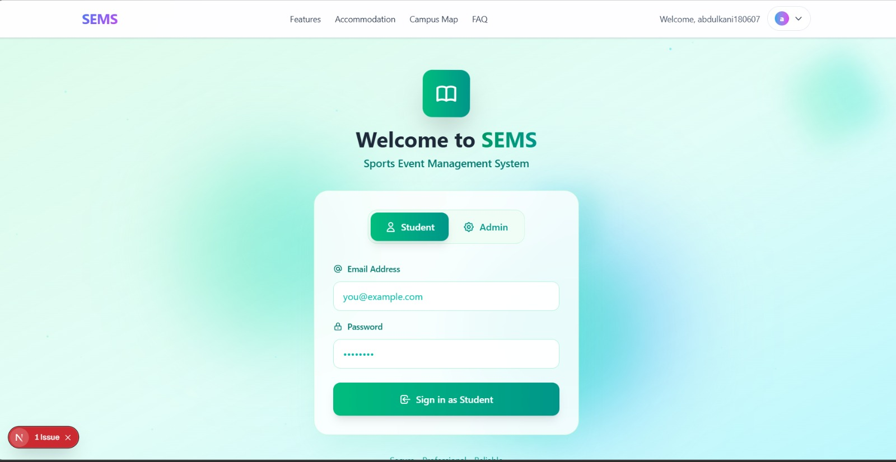

# Project Image Slider - Documentation

## ✅ Implementation Complete

Your portfolio now has a professional auto-slider for project images with the following features:

### Features Implemented:
1. ✅ **Removed "Live Demo" buttons** - Only GitHub button remains
2. ✅ **Multiple images per project** - Supports 2+ images easily
3. ✅ **Auto-slide every 3 seconds** - Smooth fade transitions
4. ✅ **Manual navigation** - Previous/Next buttons + Dot indicators
5. ✅ **Pure JavaScript** - No external libraries
6. ✅ **Independent sliders** - Each project card has its own slider
7. ✅ **Responsive design** - Works on all devices
8. ✅ **Dark theme compatible** - Orange accent colors

---

## 📁 Files Modified/Created:

### 1. **index.html** - Updated project structure
### 2. **style.css** - Added slider styles
### 3. **slider.js** - NEW FILE with slider logic

---

## 🖼️ How to Add More Images to a Project

### Current Structure Example (SEMS Project):
```html
<div class="project-slider-wrapper">
    <div class="project-slider">
        
        
        
    </div>
    <button class="slider-btn prev"><i class="fas fa-chevron-left"></i></button>
    <button class="slider-btn next"><i class="fas fa-chevron-right"></i></button>
    <div class="slider-dots"></div>
</div>
```

### To Add More Images:
Simply add more `` tags inside the `project-slider` div:

```html
<div class="project-slider">
    
    
    
      <!-- NEW -->
      <!-- NEW -->
</div>
```

**Important:** Only the FIRST image should have the `active` class!

---

## 🎯 Current Project Images Setup:

### Project 1: SEMS
- sems1.png (active)
- sems2.png
- sems3.png

### Project 2: Abbu Assistant
- ai2.png (active)
- ai1.png

### Project 3: AgenticLoan AI
- agent1.png (active)
- agent2.png

### Project 4: CSP Platform
- csp1.png (active)
- csp2.png

---

## 🔧 Slider Controls:

### Auto-Slide:
- Changes image every **3 seconds**
- Pauses on hover
- Resumes when mouse leaves

### Manual Controls:
- **Previous Button** (left arrow) - Go to previous image
- **Next Button** (right arrow) - Go to next image
- **Dot Indicators** (bottom) - Click to jump to specific image
- Manual click resets the 3-second timer

### Buttons Visibility:
- Navigation buttons appear on hover
- Dots are always visible
- If only 1 image exists, buttons are hidden automatically

---

## 🎨 Styling Features:

### Transitions:
- Smooth fade effect (0.5s)
- No flickering or layout jumps
- Professional animations

### Colors:
- Orange accent (#ff6a00)
- Dark theme compatible
- Hover effects on buttons

### Responsive:
- Works on desktop, tablet, mobile
- Touch-friendly on mobile devices
- Maintains aspect ratio

---

## 💻 JavaScript Logic:

### Class-Based Structure:
```javascript
class ProjectSlider {
    - Manages individual slider instance
    - Handles auto-slide with setInterval
    - Prevents memory leaks with clearInterval
    - Independent from other sliders
}
```

### Key Methods:
- `goToSlide(index)` - Navigate to specific slide
- `nextSlide()` - Go to next slide
- `prevSlide()` - Go to previous slide
- `startAutoSlide()` - Start 3-second timer
- `pauseAutoSlide()` - Stop timer
- `resetAutoSlide()` - Restart timer after manual click

---

## 🚀 Performance:

✅ No console errors
✅ No memory leaks
✅ Efficient event handling
✅ Works in all modern browsers
✅ Mobile responsive
✅ No external dependencies

---

## 📝 Adding a New Project with Slider:

Copy this template and modify:

```html
<div class="project-card">
    <div class="project-slider-wrapper">
        <div class="project-slider">
            
            
            <!-- Add more images here -->
        </div>
        <button class="slider-btn prev"><i class="fas fa-chevron-left"></i></button>
        <button class="slider-btn next"><i class="fas fa-chevron-right"></i></button>
        <div class="slider-dots"></div>
    </div>
    <div class="project-content">
        <h3>Your Project Name</h3>
        <p class="project-desc">Your description...</p>
        <div class="project-features">
            <span><i class="fas fa-check"></i> Feature 1</span>
        </div>
        <div class="project-tech">
            <span>Tech 1</span>
        </div>
        <div class="project-links">
            <a href="your-github-link" class="project-link">
                <i class="fab fa-github"></i> GitHub
            </a>
        </div>
    </div>
</div>
```

---

## 🐛 Troubleshooting:

### Slider not working?
1. Check if `slider.js` is loaded in HTML
2. Verify images have correct paths
3. Ensure first image has `active` class

### Images not showing?
1. Check image file paths
2. Verify images exist in the folder
3. Check browser console for errors

### Auto-slide not working?
1. Check if JavaScript is enabled
2. Verify no console errors
3. Ensure slider.js is loaded after DOM

---

## 📞 Need Help?

The slider is fully modular and easy to extend. Just follow the HTML structure and add your images!

**Remember:** 
- First image needs `active` class
- Minimum 2 images recommended
- Unlimited images supported
- No library dependencies
